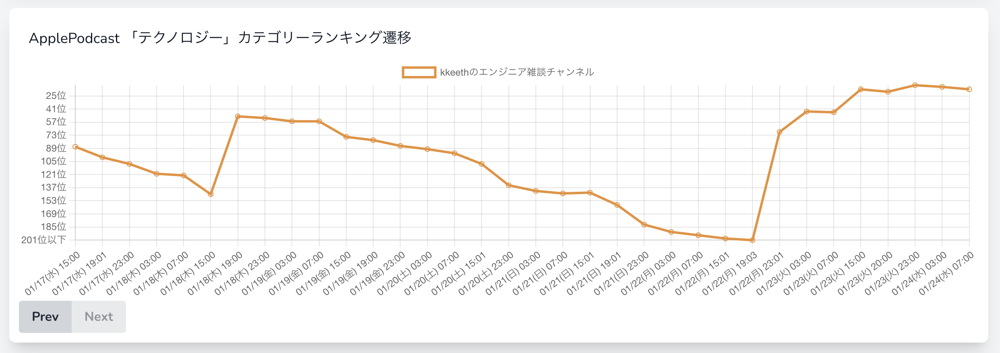

# 0124

## 濁流

- うんちくエウレーカウミガメのスープ #115 が面白すぎた
  - 実話：1980 年代（というか 1987 年），700 万人の子供が一斉に消えた．なぜ
    - これはアメリカらしいという感じ
    - 面白すぎた
  - 住民に殺害計画を立てられた聖職者
    - これもまぁ理解できるし，あーなるほど！と思ってスッキリした
  - 1973 年オイルショック
  - 1920 年世界恐慌
  - 1972 年 2 月 19 日から 2 月 28 日 連合赤軍によるあさま山荘事件
    - 機動隊員がカップヌードルを食べていた
    - それがテレビで何度も報道され，美味そうだなと言うことで流行った
- ポッドキャスト配信時間
  - 最近はサボってしまっていて，朝の 8:00 に配信することができていない
  - が，その代わり再生数やランキング（apple podcast）の順位が平日なのにもかかわらず高め
    
  - 13:00〜15:00 あたりに発信しても良さそう
- バルバス・バウ
  - よくある船の出っ張り
  - 逆位相の波を発生させることで速く走れるため，らしい
- 組織のコミッター
  - ゆめみ社の中の話
  - リーダーをどうするか
